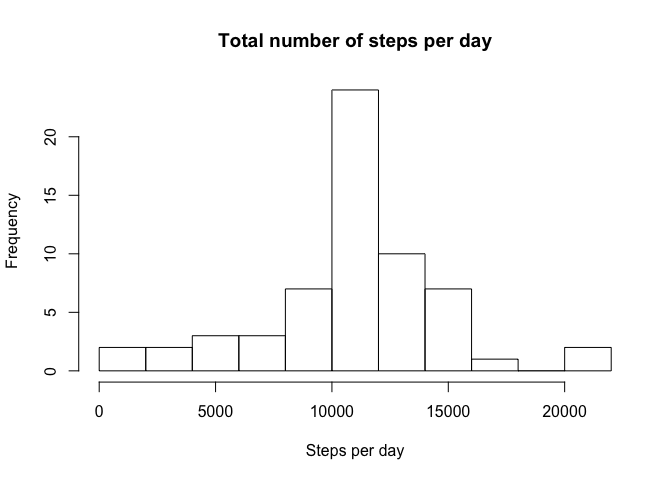

# Reproducible Research: Peer Assessment 1

## Loading and preprocessing the data


```r
library(dplyr)
```

```
## 
## Attaching package: 'dplyr'
## 
## The following objects are masked from 'package:stats':
## 
##     filter, lag
## 
## The following objects are masked from 'package:base':
## 
##     intersect, setdiff, setequal, union
```

```r
library(ggplot2)
# unzip file if necessary
if(!file.exists("activity.csv")) { 
  unzip ("activity.zip", exdir=".")
}
activity <- read.csv("activity.csv", na.strings="NA")
```

## What is the mean total number of steps taken per day?

We group the activity by day ('date' is a factor here) and calculate the sum of 
steps for each day:


```r
activity.day <- group_by(activity, date)
activity.day.total <- summarise(activity.day, sum(steps))
```

This gives us the following histogram:


```r
names(activity.day.total) <- c('date', 'total.steps')
hist(activity.day.total$total.steps, breaks=8, 
     main="Total number of steps per day", xlab="Steps per day")
```

 

### Mean and median


```r
steps.mean <- format(mean(activity.day.total$total.steps, na.rm=TRUE), 
                     scientific=F)
steps.mean
```

```
## [1] "10766.19"
```

```r
steps.median <- format(median(activity.day.total$total.steps, na.rm=TRUE), 
                       scientific=F)
steps.median
```

```
## [1] "10765"
```

The mean of the total number of steps taken per day is __10766.19__ and the 
median is __10765__.

## What is the average daily activity pattern?

The average daily activity pattern looks as follows:


```r
activity.timeseries <- group_by(activity, interval)
activity.timeseries.mean <- summarise(activity.timeseries, mean(steps, 
                                                                na.rm=TRUE))
names(activity.timeseries.mean) <- c('interval', 'steps.mean')
ggplot(activity.timeseries.mean, aes(interval, steps.mean)) + 
  geom_line() +
    xlab("5 minute Intervals") +
    ylab("Average Number of Steps")
```

 


```r
max.steps <- max(activity.timeseries.mean$steps.mean)
activity.timeseries.mean.sorted <- 
  activity.timeseries.mean[rev(order(activity.timeseries.mean$steps.mean)),]
max.steps.interval <- activity.timeseries.mean.sorted[1,1]
max.steps.interval
```

```
## Source: local data frame [1 x 1]
## 
##   interval
##      (int)
## 1      835
```

On average across all the days in the dataset, the highest number of steps 
(206.1698113) is taken in interval __835__.

## Imputing missing values

Calculating the missing values for each column, we see that only the 'steps' 
column is missing data:


```r
apply(is.na(activity),2,sum)
```

```
##    steps     date interval 
##     2304        0        0
```

To fill in the missing data, we add the mean number of steps per interval for 
every interval that is missing data (calculated and stored in the `activity.timeseries.mean` 
dataframe in the previous section):


```r
activity.nomissing <- cbind(activity,activity.timeseries.mean[2])
activity.nomissing$steps[is.na(activity.nomissing$steps)] <- 
  activity.nomissing$steps.mean[is.na(activity.nomissing$steps)]
drop <- c('steps.mean')
activity.nomissing <- activity.nomissing[,!names(activity.nomissing) %in% drop]
```

This gives us a dataframe with no missing data:


```r
apply(is.na(activity.nomissing),2,sum)
```

```
##    steps     date interval 
##        0        0        0
```

### Plotting the histogram for filled in data

We now follow the same procedure as in the first section, first grouping the 
activity by day ('date' is again a factor) and calculating the sum of steps for 
each day:


```r
activity.nomissing.day <- group_by(activity.nomissing, date)
activity.nomissing.day.total <- summarise(activity.nomissing.day, sum(steps))
```

This gives us the following histogram:


```r
names(activity.nomissing.day.total) <- c('date', 'total.steps')
hist(activity.nomissing.day.total$total.steps, breaks=8, 
     main="Total number of steps per day", xlab="Steps per day")
```

 

### Mean and median with filled in data


```r
steps.mean.nomissing <- format(mean(activity.nomissing.day.total$total.steps), 
                               scientific=F)
steps.mean.nomissing
```

```
## [1] "10766.19"
```

```r
steps.median.nomissing <- format(median(activity.nomissing.day.total$total.steps), 
                                 scientific=F)
steps.median.nomissing
```

```
## [1] "10766.19"
```

The mean of the total number of steps taken per day when data has been filled in 
is __10766.19__ and the median is __10766.19__. Note 
that the mean is __exactly the same__ as before after this operation, but the median 
is now ever so slightly higher - indeed it has become __equal to the mean__.

## Are there differences in activity patterns between weekdays and weekends?


```r
activity$date <- strptime(activity$date, format="%Y-%m-%d")
weekdays <- c('Monday', 'Tuesday', 'Wednesday', 'Thursday', 'Friday')
activity$time.of.week <- factor((weekdays(activity$date) %in% weekdays), 
                                levels=c(FALSE, TRUE), 
                                labels=c('weekend', 'weekday'))
activity$date <- as.character(activity$date)
activity.wday <- group_by(activity, interval, time.of.week)
activity.wday.timeseries.mean <- summarise(activity.wday, mean(steps, 
                                                               na.rm=TRUE))
names(activity.wday.timeseries.mean) <- c('interval', 'time.of.week', 
                                          'steps.mean')

ggplot(activity.wday.timeseries.mean, aes(as.integer(interval), steps.mean)) +
    geom_line() +
    xlab("5 minute Intervals") +
    ylab("Average Number of Steps") +    
    facet_grid(time.of.week ~ .)
```

 

From this plot we can see that there is more general activity throughout the day in weekends, whereas weekdays are characterized by an activity spike in the morning and less activity later in the day. 
